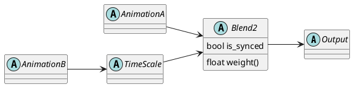
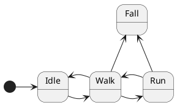
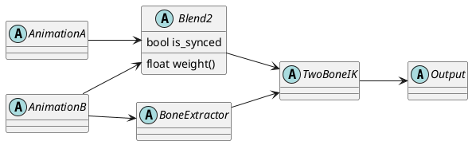
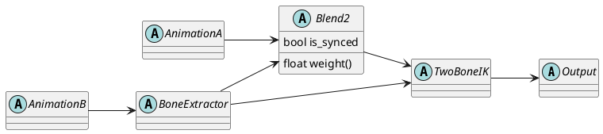
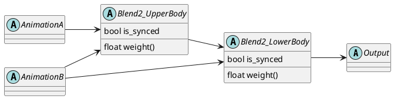
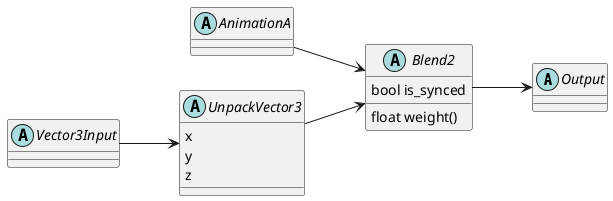

# AnimationGraph

## Blend Trees

A Blend Tree is a directed acyclic graph. Nodes produce or process "AnimationData" and the connections transport "
AnimationData". "AnimationData" here is anything that can be sampled in an Animation.

### Example:



A Blend Tree always has a designated output node where the time delta is specified as an input and after processing of
the Blend Tree it emits the animation data.

Some nodes have special names in the Blend Tree:

* **Root node** The output node is also called the root node of the graph.
* **Leaf nodes** These are the nodes that have no inputs. In the example these are the nodes AnimationA and AnimationB.

### Animation and Animation Data

For Godot an Animation has multiple tracks where each Track is of a specific type such as "Position", "Rotation", "
Method Call", "Audio Playback", etc. Each Track is associated with a node path on which the value of a sampled Track
acts.

Animation Data represents a sampled animation for a given time. For each track in an animation it contains the sampled
values, e.g. a Vector3 for a position, a Quaternion for a rotation, a function name and its parameters, etc.

## State Machines



## 1. Generalized data connections / Support of math nodes (or non-AnimationNodes in general)

### Description

The connections in the current AnimationTree only support animation values. Node inputs are specified as parameters of
the AnimationTree. E.g. it is not possible to do some math operation on the floating point value that ends up as blend
weight input of a Blend2 node.

We use the term "value data" to distinguish from Animation Data.

### Use case

* Enables animators to add custom math for blend inputs or to adjust other inputs (e.g. LookAt or IK
  targets).
* Together with "Support of multiple output sockets" this can be used to add input parameters that affect multiple node
  inputs.

### Effects on the graph topology

* Need to generalize Output Sockets to different types instead of only "Animation Data".
* How to evaluate? Two types of subgraphs:
    * a) Data/value inputs (e.g. for blend weights) that have to be evaluated before UpdateConnections. Maybe restrict
      to data that is not animation data dependent?
    * b) Processing nodes, e.g. for extracted bones.

## 2. Support of multiple output sockets

### Description

Current AnimationTree nodes have a single designated output socket. A node cannot extract a value that then gets used as
input at a laters tage in the graph.

**Depends on**: "Generalized data connections".

### Use case

* E.g. extract Bone transform and use in pose modifying nodes.
* Chain IK.

### Effects on graph topology

* Increases Node complexity:
    * AnimOutput
    * AnimOutput + Data
    * Data
      (Data = bool, float, vec3, quat or ...)
* Can a BlendTree emit values?
    * If so: what happens with the output if the BlendTree is used in a State Machine?
        * => Initially: State Machines only emit Animation Data.
* Simplest case:
    * All value data connections are evaluated always before UpdateConnections.
    * BlendTrees (and therefore embedded graphs) cannot emit values.

### Open Issues

1. Unclear when this is actually needed. Using more specific nodes that perform the desired logic
   may be better (
   c.f. https://dev.epicgames.com/documentation/en-us/unreal-engine/animation-blueprint-bone-driven-controller-in-unreal-engine).
   Likely this is not crucial so should be avoided for now.

## 3. Multi-skeleton evaluation

### Description

Allow an animation graph to affect multiple skeletons.

### Use case

Riding on a horse, interaction between two characters.

## 4. Output re-use

### Description

Output of a single node may be used as input of two or more other nodes. One has to consider re-use of Animation Data
and general value data (see "Generalized data connections") separately.

#### Animation Data Output re-use

Animation Data connections are generally more heavy weight than "Generalized data connections". The latter only contain
a small data type such as a Vector3 or Quaternion, whereas Animation Data is a container of those (and possibly more,
e.g. function names and their parameters). So it is desirable to have a minimal number of Animation Data objects
allocated.



In this case the Animation Data output of AnimationB is used both in the Blend2 node and the BoneExtractor node. The
extracted bone information is passed into the TwoBoneIK node. For this to work we have to ensure that the output of
AnimationB is freed only when both the Blend2 node and the BoneExtractor have finished their work.

An alternative layout with the same nodes would not suffer from this:



Here the AnimationData output of BoneExtractor is used by Blend2 and the extracted bone information is still passed to
the TwoBoneIK.

A more complex case is the following setup where Animation Data is used by two nodes:



Here the output of AnimationB is used in both Blend2_UpperBody and Blend2_LowerBody. However, if both blends are synced
the Blend2_UpperBody and Blend2_LowerBody nodes may compute different time values as their SyncTracks differ. Generally
a connection is invalid if the Animation Data of a node gets combined with itself via a different path in the tree.

#### Data value re-use



Here the UnpackVector3 provides access to the individual 3 components of a Vector3 such that e.g. the x value can be
used as an input to a weight node.

Data value re-use is not a problem as the values would be stored directly in the nodes and are not allocated/deallocated
when a node becomes active/deactivated.

### Use case

* Depends on "Generalized data connections" an input that does some computation gets reused in two separate subtrees.

## 5. Inputs into Subgraphs

### Description

An embedded blend tree can receive inputs of the surrounding blend tree. Inputs are animations or - depending on 1. -
also general input values.

### Use case

* Reuse of some blend logic or to move logic of a part of a blend tree into its own node.

### Effects on graph topology

* Great flexibility and possibly reusability.
* Improves logical block building.
* Probably only of bigger use with 1.

### Open issues

* Inputs to embedded state machines?

## 6. Evaluation API

### Description

Evaluation of a node happens in multiple phases:

1. UpdateConnections(): right to left (i.e. from the root node via depth first to the leave nodes)
2. CalculateSyncTracks(): left to right (leave nodes to root node)
3. UpdateTime(): right to left
4. Evaluate(): left to right

One question here is how to transport the actual data from one node to another. There are essentially two options:

#### Data owned by connections

#### Explicit input node references

Nodes store references or pointers to all input nodes.

``` C++
void Node::evaluate(AnimationData& output) {
    AnimationData input_node_0_data;
    input_node_0->evaluate(input_node_0_data);
  
    AnimationData input_node_1_data;
    input_node_1->evaluate(input_node_1_data);
  
    output = lerp(input_node_0_data, input_node_1_data, blend_weight);
}
```

* [-] Makes Blend Tree evaluation recursive.

#### Indirect input node references

```c++
// BlendTree.cpp
void BlendTree::initialize_tree() {
    for (int i = 0; ci < num_connections; i++) {
        const Connection& connection = connections[i];
        connection.target_node->set_input_node(connection.target_socket_name, connection.source_node);
    }
}

void BlendTree::activate_inputs() {
    for (int i = 0; i < num_nodes; i++) {
        if (nodes[i].is_active()) {
            nodes[i].activate_inputs()
        }
    }
}

void Blend2Node::activate_inputs() {
    if (weight < EPS) {
        input_node_0->set_active(false);
    } else {
        input_node_0->set_active(true);
    }

    if (weight > 1.0 - EPS) {
        input_node_1->set_active(false);
    } else {
        input_node_1->set_active(true);
    }
}

void BlendTree::calculate_sync_tracks() {
   for (int i = num_nodes; i > 0; i--) {
        if (nodes[i]->is_active()) {
            nodes[i]->calculate_sync_track();
        }
   }
}

void BlendTree::propagate_time() {
   for (int i = 1; i < num_nodes; i++) {
        if (nodes[i]->is_active()) {
            nodes[i]->update_time();
        }
   }
}

void BlendTree::evaluate(AnimationData& output) {
    for (int i = num_nodes; i > 0; i--) {
        if (nodes[i]->is_active()) {
            nodes[i]->output = AnimationDataPool::allocate();
            nodes[i]->evaluate();
            
            // node[i] is done, so we can deallocate the output handles of all input nodes of node[i].
            for (AnimationGraphnNode& input_nodes: input_nodes[i]) {
                AnimationDataPool::deallocate(nodes[i].output);
            }
        }
        
        nodes[i]->set_active(false);
    }
    
    output = nodes[0].output;

    // free output buffers    
    for (int i = 1; i < num_nodes; i++) {
        AnimationDataPool::deallocate(nodes[i].output);
    }
}

void Blend2Node::evaluate(AnimationData& output) {
    output = lerp(input_node_0->get_output(), input_node_1_data->get_output(), blend_weight);
}

void TimeScaleNode::evaluate(AnimationData& output) {
    std::swap(output, input_node_0->output);
}
```

```c++
// Node.cpp
void Node::evaluate(AnimationData& output) {
    output = lerp(input_node_0->get_output(), input_node_1_data->get_output(), blend_weight);
}
```

#### Data injected by Blend Tree

Nodes store references or pointers to all input nodes.

```c++
void Node::evaluate(const Array<const AnimationData*>& animation_inputs, const Array<const Variant>& data_inputs>, AnimationData& output) {
    output = lerp(animation_inputs[0], animation_inputs[1], data_inputs[0]);
}
```

* [+] This would allow easy extension of animation nodes via GDScript or GDExtension based nodes.
    * [-] Though this could maybe be achieved using a specific customizable node for other approaches.
* [-] Easy to mess up indices.
* [-] Type safety of data_inputs messy.

## Glossary

### Animation Data

Output of an AnimationGraphNode. Contains everything that can be sampled from an animation such as positions, rotations
but also method calls including function name and arguments.
